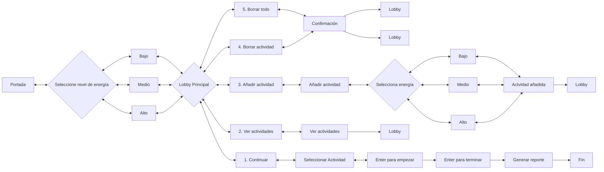

```mermaid
flowchart LR
    Inicio[Portada] <--> Energía{Seleccione nivel de energía}

    Energía <--> Bajo[Bajo]
    Energía <--> Medio[Medio]
    Energía <--> Alto[Alto]

    Bajo[Bajo] <--> Lobby{Lobby Principal}
    Medio[Medio] <--> Lobby{Lobby Principal}
    Alto[Alto] <--> Lobby{Lobby Principal}

    Lobby <--> 5[5. Borrar todo]
    Lobby <--> 4[4. Borrar actividad]
    Lobby <--> 3[3. Añadir actividad]
    Lobby <--> 2[2. Ver actividades]
    Lobby <--> 1[1. Continuar]

    5 <--> Confirmación[Confirmación] --> o5[Lobby]
    
    4 <--> Confirmación[Confirmación] --> o4[Lobby]

    3 <--> Añadir[Añadir actividad]
    Añadir <--> Energía2{Selecciona energía}

    Energía2 <--> Bajo2[Bajo]
    Energía2 <--> Medio2[Medio]
    Energía2 <--> Alto2[Alto]

    Bajo2 <--> Nueva[Actvidad añadida]
    Medio2 <--> Nueva[Actvidad añadida]
    Alto2  <--> Nueva[Actvidad añadida]

    Nueva --> o3[Lobby]

    2 <--> Ver[Ver actividades] --> o2[Lobby]

    1 <--> Continuar[Seleccionar Actividad]
    Continuar <--> Empezar[Enter para empezar]
    Empezar --> Terminar[Enter para terminar]

    Terminar --> Reporte[Generar reporte]

    Reporte --> Fin[Fin]
```